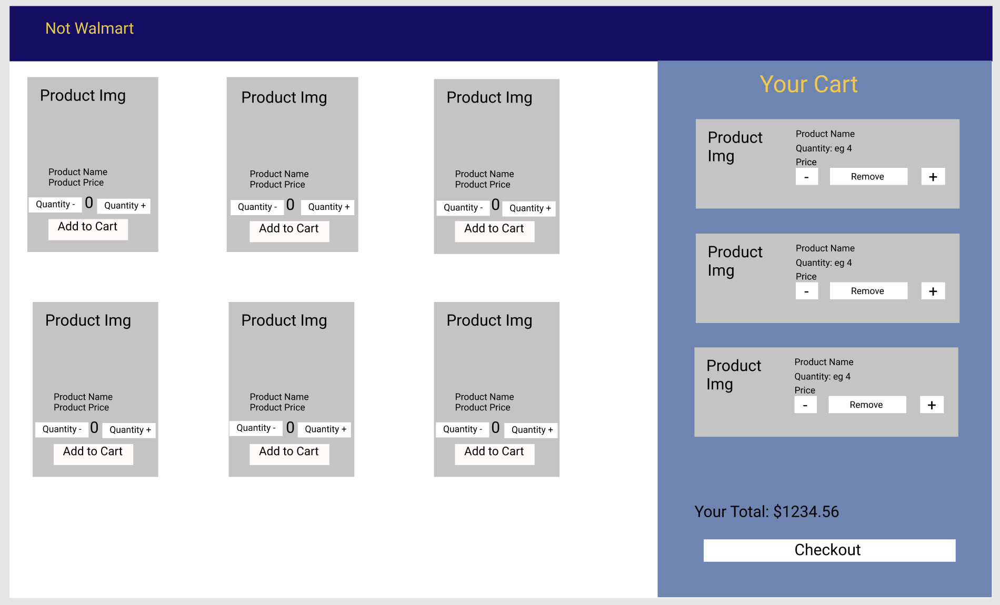
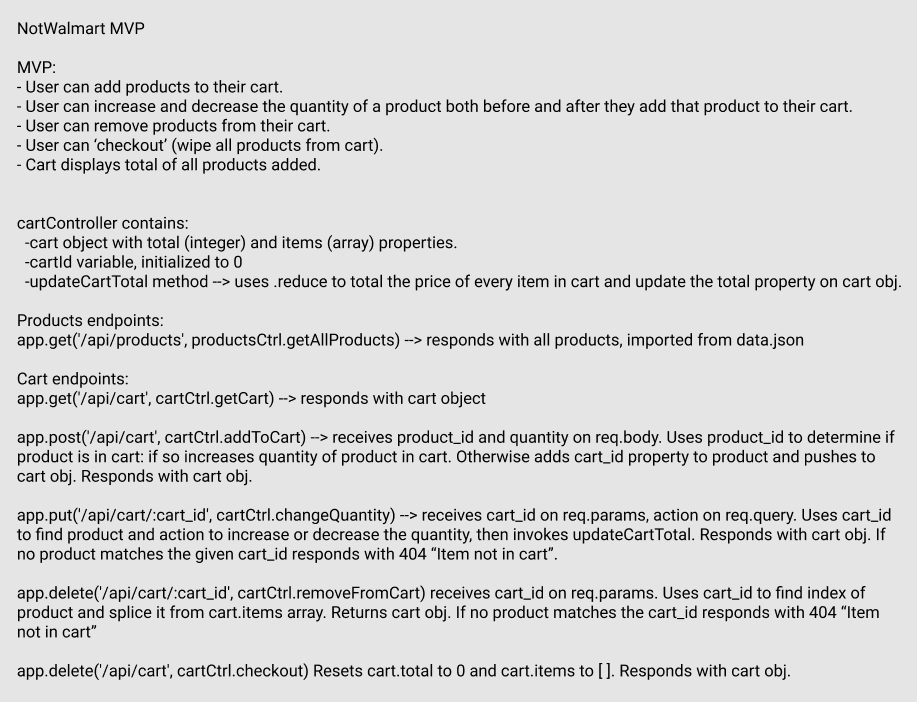

# Not Walmart

This is an application built for demonstrating principles of React and Node.js using Express.

## Working example

https://not-walmart.herokuapp.com/

## Application plan

A good plan is essential to a successful app. Here you will find wireframes, a component tree (featuring state, props, and methods for each component), and planned out endpoints for the back end.

## Steps to complete

### Back end (Express)

According to our plan we need endpoints that do the following:

- GET `/api/products` | `getAllProducts`
  - Serve up the array of products stored in the data.json file.
- GET `/api/cart` | `getCart`
  - Serve up an object to be stored in the `cartController.js` file. The object should contain a `total` property (number) and a `items` property (array of objects).
  - Each item in the `cart.items` array should have `id`, `cart_id`, `name`, `image`, `price`, and `quantity` properties.
- POST `/api/cart` | `addToCart`
  - Add a product to our cart and serve the updated cart object
  - It requires that the body have `product_id` and `quantity` properties.
  - We should first check if the product is already in our `cart.items` array. If it is, we should just update the quantity.
  - If the product is not currently in our array, we should use the `product_id` to find the corresponding product, add a `cart_id` and `quantity` property to it and push it to our `cart.items` array.
  - We then need to update the total property on the cart and send the entire `cart` object.
- PUT `/api/cart/cart_id` | `changeQuantity`
  - Change the quantity of a specified product in our cart.
  - Requires a `cart_id` on params and a `action` query (must be `'up'` or `'down'`)
  - Find the corresponding item in our `cart.items` array and modify the quantity accordingly
  - If the quantity would drop to 0, we should remove the item.
  - Calculate the updated `total` property
  - Serve up the updated `cart` object
- DELETE `/api/cart/cart_id` | `removeFromCart`
  - Remove a specified product from our cart
  - Requires a `cart_id` on params
  - Use that `cart_id` to find the correct item and remove it from the `cart.items` array
  - Calculate the updated `total` property
  - Serve up the updated `cart` object
- DELETE `/api/cart` | `checkout`
  - Reset the `cart` object to its starting values
  - Serve up updated `cart` object

Once that functionality is intact, we should test all of it using Postman.

### Front end (React)

We need the following components

- Header (function)
  - Just displays header
- Display (class)
  - Our main logic component
  - state should include: products (array) and cart (object: total (number), items (array))
  - Methods should include: `componentDidMount`, `addToCart`, `changeQuantity`, `removeFromCart`, `checkout`
    - Each of these should make corresponding network calls to their matching endpoints
- Products (function)
  - props should include: `products` (array), `addToCart` (function)
  - This component will map over our products array and return a `Product` component for each item.
- Product (class)
  - props should include `data` (object), `addToCart` (function)
  - state should include `quantity` (number)
  - methods should include `changeQuantity` and `handleAddToCart`
  - Should display all info about product
  - Should allow to select a quantity and add that item to cart.
- Cart (function)
  - props should include `cart` (object), `changeQuantity`, `removeFromCart`, `checkout` (functions)
  - It should contain our cart total and a map of the `items` array in the `cart` prop which will return a `CartItem` for each item
  - There should also be a button to checkout
- CartItem (function)
  - props should include `data` (object), `changeQuantity`, `removeFromCart` (functions)
  - Should show all info about the product
  - Should provide buttons to either increase or decrease quantity
  - Should allow to remove item from cart
